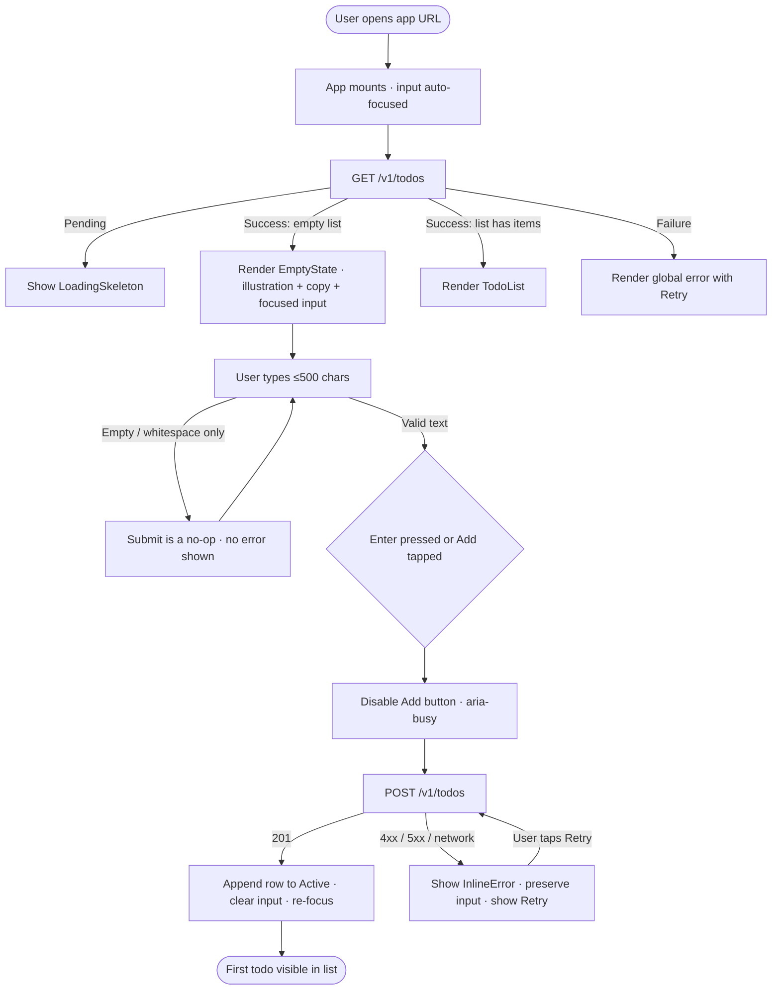
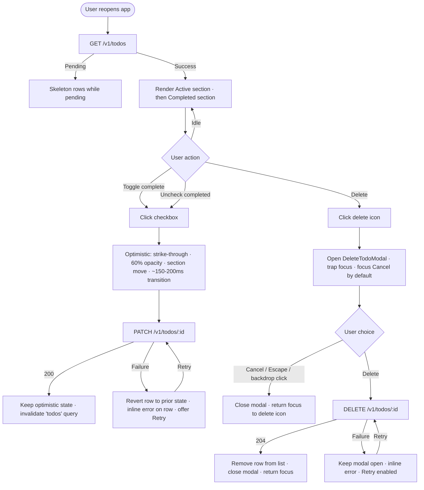
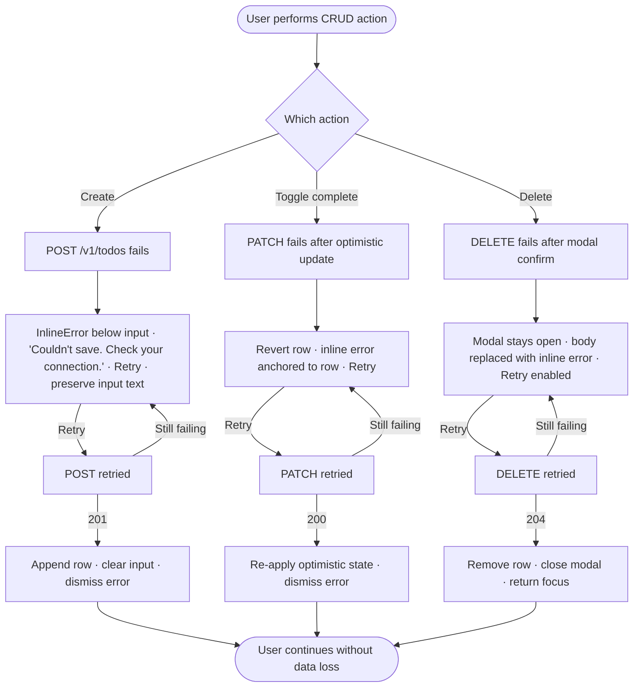
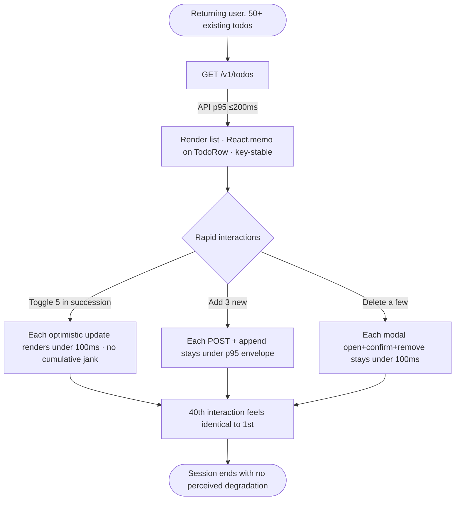

# UX Design Specification — Todo App

**Author:** Lucian Condescu
**Date:** 2026-04-18

---

<!-- UX design content will be appended sequentially through collaborative workflow steps -->

## Executive Summary

### Project Vision

A minimal, reliable personal todo application that a first-time user can use end-to-end in under 60 seconds with zero onboarding. The UX promise is "Apple Notes lightness with first-class completion semantics and durable persistence" — open URL, start typing, cross things off, trust that nothing is ever lost. Interaction latency must feel like a sticky note, not a web page (UI p95 ≤100ms, API p95 ≤200ms).

The differentiator is **intentional minimalism enforced at every decision point**: no accounts, no onboarding, no feature menu, no productivity methodology. The empty state *is* the tutorial.

### Target Users

**Single persona in MVP:** a solo individual managing their own short-lived tasks from a personal browser (desktop or mobile).

- **Context of use:** anywhere — laptop at a desk, phone on a subway, tablet on a couch. Equal-quality experience across all three is a hard constraint (responsive down to 320px, 44×44 minimum tap target).
- **Tech-savviness:** assumed comfortable with a modern browser; not assumed to read instructions, accept cookie walls, or create accounts.
- **Adjacent mental model:** closer to "sticky note on the fridge" than to "project management tool." Users who want priorities, deadlines, labels, or collaboration are explicitly not the target persona.

**Not target personas (deferred to Growth / Vision):** teams, shared-list collaborators, assignees, enterprise admins, SSO consumers, power users demanding structured task metadata.

### Key Design Challenges

1. **Earning the "zero onboarding" promise visually.** The empty state must simultaneously teach, invite action, and avoid the feel of a marketing page. One illustration, one line of copy ("No todos yet. Add one below."), one focused input — nothing else.
2. **Completion as the hero interaction.** Strike-through + 60% opacity + section reorder is the product's defining moment. It must feel satisfying *and* meet WCAG 2.1 AA 4.5:1 contrast at 60% opacity — a binding constraint (NFR-007, FR-006).
3. **Destructive-action friction vs. sticky-note lightness.** The delete confirmation modal is the one heavy interaction in a deliberately light product. Tone, weight, and motion need calibration so it doesn't feel bureaucratic.
4. **Error states without breaking trust.** FR-010 inline errors with preserved input and a Retry button must feel like part of the product, not a failure. Copy tone is load-bearing: "Couldn't save. Check your connection."
5. **Responsive down to 320px with 44×44 tap targets** on a row carrying checkbox + description + delete icon. Cramping on small phones breaks the "works on my commute" promise and SC-004.

### Design Opportunities

1. **Typography and whitespace as the visual identity.** With no feature chrome to lean on, the type scale and spacing rhythm *are* the brand. This is the "Todoist is an airport, this is a notepad" differentiation.
2. **Micro-interactions on completion.** A considered strike-through transition — not instant, not slow — is low-cost polish that rewards the core action and makes the app feel alive.
3. **Empty state as product voice.** One line of copy defines the brand more than any landing page would. "No todos yet. Add one below." already sets the register — functional, unceremonious, kind.

## Core User Experience

### Defining Experience

The product is **one unbroken loop**: type → Enter → check → cross off → delete. That loop is the whole experience. Every surface exists to serve a position in that loop; anything that doesn't serve the loop is scope creep.

- **Core user action:** **creating a todo** (type + Enter). It is the action that converts a first-time visitor into a user in under 60 seconds (SC-001), and the action performed most frequently in sustained use. Get this one right and everything else follows.
- **Core moment of satisfaction:** **completing a todo** — the strike-through + 60% opacity + section reorder. This is the interaction the product is selling, the one the user returns for.

### Platform Strategy

- **Platform:** Responsive web app, browser-first. No native apps, no PWA, no desktop app in MVP.
- **Input modes equal-priority:** keyboard+mouse (desktop) and touch (mobile/tablet). Neither is second-class.
  - Keyboard: Enter submits. Tab order reaches every interactive element with a visible focus ring. Escape closes modal.
  - Touch: 44×44px minimum tap target (iOS HIG). No hover-only affordances.
- **Viewport range:** 320px → desktop. Zero horizontal scroll at any width ≥320px.
- **Browsers:** Evergreen Chrome / Firefox / Safari + iOS 15+. IE and legacy Edge unsupported.
- **Offline:** Not offline-first in MVP. Network failures surface as inline errors with Retry (offline-first deferred to Vision).
- **Device capabilities leveraged:** native `<input type="checkbox">` and native `<dialog>` for focus-trap and Escape-close — accessibility primitives for free, no third-party dependencies.

### Effortless Interactions

- **Type → Enter → done.** No confirm step, no "Save" button click, no post-submit modal. Enter commits. The input clears and re-focuses automatically for the next entry.
- **One click to complete.** The checkbox is the whole completion UI — no separate "Mark done" menu, no drag gesture, no right-click.
- **Zero onboarding, zero setup.** Open URL and type. No account, no welcome tour, no cookie banner.
- **Persistence is invisible.** The user never sees a "Save" state, a sync indicator, or a "your data is stored" notice. It just works.
- **Focus management is automatic.** Empty state: input focused. After submit: input cleared and re-focused. After modal close: focus returns to the delete icon that opened it.

### Critical Success Moments

1. **First todo created within 60 seconds of landing** (SC-001). If a first-time user fumbles here, the thin-wedge promise is broken.
2. **First completion checked.** The strike-through + opacity + section-reorder is the moment the user thinks "yes, this is nice."
3. **First reload — todos are still there.** Persistence is the trust-building moment. If this fails, the user never comes back.
4. **First error recovery.** A failed create that preserves the user's typed text and offers Retry turns a potential breaking moment into a confidence-building one.
5. **First session on mobile.** If the 320px viewport feels cramped or a tap target misses, the "works on my commute" promise dies.

**Failure modes that would ruin the experience:**

- Data loss across refresh / browser close / server restart (breaks NFR-003 — existential).
- Perceptible lag on complete or delete (breaks the sticky-note feel — NFR-001).
- Modal or error state that loses in-progress input (breaks NFR-004 trust).
- Cramped row or hidden delete icon on small-screen mobile.

### Experience Principles

1. **Serve the loop, not the feature list.** Every pixel justifies its presence by serving create → view → complete → delete. If it doesn't, it's cut.
2. **Invisible reliability.** Persistence, latency, and error recovery are felt as "nothing went wrong," never advertised as features.
3. **Equal dignity across input modes.** Keyboard and touch are peers. A keyboard-only user and a phone user each get a first-class experience.
4. **Light by default, firm on destruction.** The whole product feels weightless — except delete, which is deliberately gated by a modal. The asymmetry is intentional, not inconsistent.
5. **Copy is product.** Every string (empty state, error, modal) is UX surface. Tone is **functional, unceremonious, kind**. No marketing voice, no apology voice.

## Desired Emotional Response

### Primary Emotional Goals

- **Calm.** Opening the app should feel quieter than opening a tab. No banners, no CTAs, no brand fanfare. The user's mind should be able to treat the page as scratch paper, not a product.
- **Trust.** The user should be able to type something they need to remember and *forget about the app itself*. Persistence, latency, and error handling all roll up into this single feeling: "I can rely on this."
- **Lightness.** The whole interaction should feel as weightless as jotting on a sticky note — each keystroke, each check, each delete. Nothing is ceremonial.

If the app makes a user **tell a friend**, the sentence is: *"It just does the thing. Open it and type."* That is the emotion being optimized for — not delight, not productivity — **unburdening**.

### Emotional Journey Mapping

| Stage | Desired feeling | What creates it |
|---|---|---|
| **First landing** (empty state) | Oriented, welcomed, not sold to | Illustration + one line of copy + focused input. No signup wall, no tour. |
| **Typing first todo** | Ease, immediacy | Cursor already in input. Characters appear instantly. Enter commits. |
| **Seeing the todo appear** | Quiet satisfaction | No toast, no confetti — just the row sliding in, input clearing and re-focusing. |
| **Checking the box** | The one moment of *micro-delight* | Strike-through transition + opacity fade + section reorder — calibrated, not cartoonish. |
| **Deleting (via modal)** | Respected, not scolded | Modal copy is informative, not admonishing. Cancel is equally weighted to Delete. |
| **Reload / return visit** | Relief, trust | List is there. Exactly as it was. No spinner spin-wait; skeleton → content is fast. |
| **Network / server error** | Reassured, in control | Inline error at the exact failure site. Input preserved. Retry visible. Copy is factual, not apologetic. |
| **After sustained use** | Forgotten (in the good way) | The app fades into habit. The user thinks about tasks, not about the app. |

### Micro-Emotions

**Most critical to nail:**

- **Trust over skepticism.** Every design decision that could create doubt ("will it save?", "did it submit?", "is that button even clickable?") is a trust-bleed. The product cannot afford one.
- **Confidence over confusion.** With no onboarding, every pixel must be self-explanatory the first time. Ambiguity is a UX bug.
- **Satisfaction over delight.** Aim for *satisfaction* — the quiet kind — not *delight* (surprise, novelty). A todo app that tries to delight on every interaction becomes exhausting.
- **Calm over excitement.** Stimulation is the anti-goal. The UI should create *less* mental noise, not more.

**Explicitly avoided emotions:**

- **Pressure.** No streaks, no "X days in a row", no productivity guilt.
- **Obligation.** No nudges to complete, no "you still have 5 todos," no red badges.
- **Being sold to.** No upsell, no "you might also like," no Pro tier preview.
- **Anxiety on errors.** Error copy is never accusatory or alarmist ("Couldn't save. Check your connection." — not "Error! Your data may be lost!").

### Design Implications

| Emotion | UX design approach |
|---|---|
| **Calm** | Generous whitespace. Neutral palette. One primary action on screen at a time. No ambient motion. |
| **Trust** | Zero flicker between states (loading → empty vs. loading → content). Persistence is silent — no "saved" toast. Errors appear inline, preserve input, offer retry. |
| **Lightness** | Fast UI (NFR-001 p95 ≤100ms). Minimal chrome. No heavy borders or shadows. Small, crisp type. |
| **Satisfaction on completion** | One calibrated transition on check: strike-through + opacity + reorder, ~150–200ms, ease-out. Not bouncier; not slower. |
| **Confidence** | Visible focus rings. Clear hover/active states. Disabled buttons look disabled. Destructive actions wear a modal gate. |
| **Unburdening** | No account. No onboarding. No settings screen. No empty feature menu waiting to be discovered. |

### Emotional Design Principles

1. **Aim for satisfaction, not delight.** Micro-delight is reserved for one moment (completion). Everywhere else, the product aspires to be *unremarkable* — because unremarkable means it's not in the user's way.
2. **Silence is a feature.** No confirmation toasts for routine success. If it worked, the UI shows it worked; no announcement needed.
3. **Motion is earned, not decorative.** Transitions exist only where they clarify state change (completion reorder, modal open/close). No idle animation, no scroll parallax, no bouncy easing curves.
4. **Error copy is kind, not apologetic.** State the problem, offer the fix, preserve the user's work. Never blame the user; never perform contrition.
5. **The product disappears when it's working.** The emotional success metric is *absence*: the user does not think about the app, they think about their day.

## UX Pattern Analysis & Inspiration

### Inspiring Products Analysis

#### Apple Notes — the lightness benchmark

- **What it does well:** Zero launch friction. Open → cursor is already in a note → type. No file dialog, no template picker. The product is *effectively absent* at the moment of use.
- **Why it works:** The chrome is minimal (toolbar hides until needed), the type rhythm is comfortable, and the ambient feeling is "scratch paper." There is no "your data is saved" toast — persistence is invisible.
- **Relevant to Todo App:** Sets the bar for first-run feel. The empty state is not a tutorial — it is already the working surface.
- **What to steal:** focused input on arrival; invisible persistence; generous whitespace; no "welcome" modal; type scale that feels like paper, not a web form.

#### TeuxDeux — the minimalist web todo

- **What it does well:** Single-screen layout. One list. Enter to commit. Click to complete. Strike-through is the *whole* feedback.
- **Why it works:** The product commits fully to being a list of strings. No priority, no tag, no deadline interface until you summon it. First-time users have no decisions to make.
- **Relevant to Todo App:** Closest analogue to the MVP. Proves the thin-wedge bet — minimal todo apps can earn daily use.
- **What to steal:** one-column layout that holds up across viewports; Enter-to-commit + input clears + re-focuses; strike-through as the hero signal; no toast on create.

#### Todoist — the **anti-reference**

- **Surface capabilities:** Natural-language date parsing, keyboard shortcuts, projects, priorities, labels, filters, karma. Dense and capable.
- **Why it is the wrong model for this product:** Every feature above is an onboarding surface. The product teaches you its mental model, then asks you to keep it in your head. For a "sticky note" audience, this is exhausting. The account wall on first load is the exact friction the brief rejects.
- **Relevant to Todo App:** A clear picture of what *not* to build. When tempted to add "just one feature," the test is "does this move us closer to Todoist?" If yes, cut it.

### Transferable UX Patterns

**Interaction patterns (adopt as-is):**

- **Input is pre-focused on load** (Apple Notes) — eliminates the one click before typing.
- **Enter commits; input clears + re-focuses** (TeuxDeux) — supports rapid-fire entry without reaching for the mouse.
- **Checkbox click is the entire completion UI** (TeuxDeux) — no menu, no confirm.
- **Strike-through + opacity as the "done" signal** (TeuxDeux) — instantly legible, no explanation needed.
- **Silent persistence** (Apple Notes) — no "saving…" state, no "saved" toast.

**Layout patterns (adopt):**

- **Single-column list on one screen** (TeuxDeux) — no sidebar, no tabs, no projects panel. Responsive-friendly by construction.
- **Chromeless header** (Apple Notes) — app title only; no nav, no avatar, no search.
- **Generous vertical whitespace between rows** — scannable list and 44×44px tap targets without a crowded feel.

**Visual patterns (adopt):**

- **System fonts** — familiar, fast-loading, zero license/setup, inherits OS type rendering quality.
- **Restrained color palette** — monochrome foreground with a single accent (checkbox + focus ring). Color carries *meaning*, not decoration.
- **Motion is functional only** — transitions mark state changes; nothing idle-animates.

**Patterns to adapt (not adopt as-is):**

- **TeuxDeux's flat list** → split into **Active / Completed sections** because FR-002 requires the completed tail. Keep the flat feel; introduce a subtle section separator, not a heavy heading.
- **Apple Notes's ambient toolbar-on-hover** → no toolbar here. Instead, an always-visible "Add" button next to the input (keyboard users use Enter; touch users get an explicit target).

### Anti-Patterns to Avoid

1. **Account wall on first load** (Todoist) — breaks SC-001 (≤60-second first-use). Forbidden by brief.
2. **Onboarding tour / welcome modal** (Todoist, Asana) — the empty state *is* the tutorial.
3. **Feature menu / hamburger / sidebar** (Todoist, Things) — suggests there is more to learn. There is not.
4. **Toast notifications for routine success** ("Task added", "Task completed") — violates "silence is a feature."
5. **Streaks, karma, productivity gamification** (Todoist Karma) — violates the "avoid pressure/obligation" emotional goal.
6. **Bouncy / playful easing curves** (consumer task apps) — conflicts with "calm." Use standard ease-out.
7. **Priority flags / color labels / tags visible by default** — visual noise that implies user decisions not required by scope.
8. **Drag-to-reorder on every row** — out of scope for MVP; adds touch-gesture complexity at 320px.
9. **Delete via swipe alone with no confirmation** (iOS native) — Todo App chose modal confirmation for destructive action; trading speed for trust.
10. **"Share / Collaborate" affordances** (Todoist, Google Tasks) — single-persona MVP; any shared-list hint is a lie.

### Design Inspiration Strategy

**What to adopt:**

- Apple Notes's **first-run focus and silent persistence** — supports Calm + Trust, and SC-001 (≤60s first-use).
- TeuxDeux's **Enter-commits + input re-focuses loop** — directly serves the "create is the core action" principle.
- TeuxDeux's **checkbox-is-the-whole-completion-UI** — serves "one click to complete."
- **Monochrome + single accent** palette — supports Calm and WCAG 2.1 AA contrast (NFR-007).
- **System font stack** — supports NFR-006 (no font download step) and the "paper" feel.

**What to adapt:**

- TeuxDeux's flat list → **Active / Completed sections** (FR-002), kept visually quiet with a minimal separator.
- Apple Notes's ambient chrome → **always-visible Add button** next to the input.
- Things 3's considered motion → **one calibrated transition on check** (~150–200ms ease-out), not the bouncy easing of consumer task apps.

**What to avoid (from Todoist and peers):**

- Account walls, welcome tours, sidebars, toasts, streaks, gamification, priority flags, drag-to-reorder, share affordances, bouncy easing.
- The "more features = more value" mental model. For this product, the opposite is true.

**The Todoist test:** when tempted to add a feature or decoration, ask "does this move us toward Todoist?" If yes, reject. The product's identity is defined by what it chose *not* to ship.

## Design System Foundation

### Design System Choice

**Tailwind CSS v4 utilities on native HTML, with a small hand-authored design-token set. No third-party component library in MVP.**

This is a themeable-foundation approach narrowed to just the utility layer — no MUI, no shadcn/ui, no Chakra. Native `<input type="checkbox">`, native `<dialog>`, native `<button>`, styled with Tailwind classes, plus a handful of custom React components (`TodoRow`, `DeleteTodoModal`, etc.) composed from those utilities.

### Rationale for Selection

1. **Architecture-consistent.** The architecture doc pins Tailwind v4 via `@tailwindcss/vite` and explicitly rejects a component library for MVP ("low component count; revisit shadcn/ui if inventory grows"). Respecting that lets this UX spec flow straight into implementation with zero tool-chain churn.
2. **Matches the product's minimalism.** Pulling in MUI or Ant Design drags visual weight the product explicitly rejects (shadows, elevations, opinionated motion curves, dense component chrome). Those libraries are designed for feature-rich apps; this product is the opposite.
3. **Native HTML gets accessibility for free.** `<input type="checkbox">` and `<dialog>` cover most of FR-006 / NFR-007 (keyboard, focus trap, Escape-close) with no third-party dependency. axe-core in CI verifies the contract. No component-library abstraction layer stands between the user and the DOM.
4. **Supports NFR-006 (≤15-min onboarding).** A new engineer sees Tailwind class strings on plain HTML — no library conventions, no component-tree indirection. The learning curve is the Tailwind docs, nothing else.
5. **Performance aligns with NFR-001 (UI p95 ≤100ms).** No runtime component-library overhead, no JS for modal/checkbox behavior. Tailwind emits static utility CSS at build time.
6. **Low total component count justifies it.** The PRD Component Inventory is eight components. A design system aimed at scale would be over-engineered.

**Explicitly rejected alternatives:**

- **MUI / Ant Design / Chakra** — visual tonality conflicts with "sticky note" product; bundle weight conflicts with latency targets.
- **shadcn/ui** — reasonable default for larger React apps, but its value is component inventory we do not need. Revisit if component count grows past ~15.
- **Pure hand-written CSS** — loses Tailwind's constraint system (consistent spacing/type tokens), the main thing protecting us from visual drift across the 8 components.
- **A fully custom design system** — no brand investment justifies the cost; this is a training project + personal-use app.

### Implementation Approach

**Tailwind v4 configuration:** defaults + a minimal **`@theme`** override in `apps/web/src/styles/index.css` for the design tokens below. No `tailwind.config.js` — Tailwind v4 reads `@theme` from CSS.

**Design tokens (MVP):**

| Token family | MVP values | Notes |
|---|---|---|
| **Color** | `--color-bg` (neutral-50/white) · `--color-fg` (neutral-900) · `--color-muted` (neutral-500) · `--color-border` (neutral-200) · `--color-accent` (single hue, mid-saturation) · `--color-danger` (delete confirm + errors) | Monochrome + single accent. Dark mode deferred. Actual hex values finalized in Visual Foundation (step 8). |
| **Typography** | System font stack (`ui-sans-serif, system-ui, -apple-system, ...`). Scale: `text-sm` (meta), `text-base` (todo description), `text-lg` (modal title), `text-xl` (app title). | System stack serves NFR-006 and the "paper" feel. No web font download. |
| **Spacing** | Tailwind's default 4px base scale. Vertical row spacing ≥ `py-3` on mobile, `py-4` on desktop. | Generous by default to support 44×44px tap targets without feeling cramped. |
| **Radius** | `rounded-md` on interactive controls; `rounded-lg` on modal. No pills, no sharp corners. | Subtle softness, consistent across controls. |
| **Shadow** | `shadow-sm` on modal only. No shadows elsewhere. | Shadows imply weight; we are avoiding weight. |
| **Motion** | `duration-150 ease-out` default; `duration-200` for the completion transition. No spring, no bounce. | Functional motion only. Respects `prefers-reduced-motion` (transitions become instant). |
| **Focus** | 2px solid `--color-accent` outline with 2px offset on all interactive elements. Never `outline: none` without a replacement. | Explicit, visible focus ring across all input modes. |
| **Breakpoints** | Tailwind defaults: `sm: 640px`, `md: 768px`, `lg: 1024px`. Map to PRD's mobile/tablet/desktop bands. | Minimum 320px supported; 44×44 tap target minimum on touch. |

### Customization Strategy

**Component authoring policy:**

- **Every component is custom, built from native HTML + Tailwind utilities.** No `<Button>` library import.
- **Variants live in the component**, not as global CSS. A `TodoRow` with `completed` prop swaps Tailwind classes; it does not toggle a global `.completed` class.
- **Design tokens are the only globals.** Component files never reference hex values or raw pixel spacing — they use Tailwind classes that map back to the `@theme` tokens.
- **Accessibility is not customizable away.** Native `<dialog>`, native `<input type="checkbox">`, and visible focus rings are non-negotiable. Anyone reaching for a custom dropdown or custom checkbox crosses a policy line; axe-core in CI backstops it.

**When to revisit this choice:**

- Component inventory exceeds ~15 distinct components.
- Two or more custom-built components diverge visibly on the same primitive (e.g., inconsistent button styles).
- A new screen is introduced that requires a pattern not trivially composable from Tailwind utilities (tables, charts, drag surfaces).
- At that point, introduce **shadcn/ui** (copy-in, not runtime library) or a `packages/ui/` — not a full component library.

## Defining Experience

### The Defining Experience

**"Type a thing. Press Enter. Check it off when done."**

Two interactions do the heavy lifting:

- **Create-by-typing** — the moment a first-time user becomes a user (SC-001, ≤60s).
- **Check-to-complete** — the recurring moment of satisfaction that brings the user back.

The product could ship with only these two interactions polished, and everything else (loading, error, delete) merely functional, and still meet its brief. These two interactions carry the product.

### User Mental Model

**Models users bring:**

- **Sticky note.** "I write a thing. I cross it off." Users expect the app to behave like physical paper.
- **Grocery list on a phone Notes app.** Users expect checkboxes to be immediate and visible. They do not expect to open a sub-menu.
- **Fresh browser tab.** Users expect the tab to *do something* the moment it loads. An empty page that needs setup breaks the model.

**Where they are likely to get confused or frustrated:**

- **"Where do I click to add?"** — solved by pre-focused input + visible Add button. The answer is *already here, just type*.
- **"Did it save?"** — users burned by web apps that lose work have trained themselves to distrust silent saves. Solved by the todo appearing immediately in the list, with no "saved" toast needed.
- **"How do I delete?"** — a pure X icon is ambiguous on mobile. Solved by a trashcan icon on every row with a 44×44px hit area.
- **"Is this complete?"** — strike-through + opacity + section-move is three reinforcing signals. One alone would be fragile; three together are unmistakable.

**Unspoken expectations inherited from Notes-class apps:**

- Keyboard Enter commits. Keyboard Escape cancels modal.
- Tab moves focus through the interactive elements.
- Refreshing the page does not lose anything.
- The browser back button does not break the app (single-screen app — no routing trap).

### Success Criteria

**Create:**

- Input is focused within 16ms of mount (no cursor-click needed).
- Typing feels 1:1 with keystrokes (no JS framework jank).
- Enter submits and the new todo appears in the list within UI p95 ≤100ms of the server response.
- Input clears and re-focuses so the user can type the next one without lifting hands.
- Empty submission is silently ignored (no error; user can tell there is nothing to submit).
- Over-length submission (>500 chars) is prevented by `maxlength=500` on the input element itself — no validation error needed.

**Complete:**

- Checkbox click → strike-through + opacity change → section move, as a single perceived transition (not three stuttered steps).
- Total transition duration ~150–200ms, ease-out. Slower feels sluggish; faster feels jarring.
- Transition is opt-out under `prefers-reduced-motion` — state change becomes instant.
- Completed text meets WCAG 2.1 AA 4.5:1 contrast at 60% opacity (NFR-007).
- Re-unchecking is symmetric: strike-through removed, opacity restored, todo moves back to the Active section.
- No toast, no undo bar, no confetti.

**Success indicators observable in usability testing:**

- First-time user types their first todo in under 10 seconds from landing, without asking a question.
- User rapidly enters 3+ todos in succession without the mouse touching anything.
- User checks a box and their face registers a tiny smile — the calibrated transition does its job.
- User refreshes the page and does not flinch — the list returns.
- User hits Escape during the delete modal and doesn't have to think about it.

### Novel UX Patterns

**All established. No novel interactions.** Every primitive is inherited from decades of form-and-list UX:

- Text input + Enter to submit (HTML forms since 1993).
- Checkbox to toggle completion (UI convention older than the web).
- Trashcan icon + confirmation modal (OS-level destructive-action convention).
- Strike-through to indicate done (paper-list convention).

**The product's differentiation is not invention; it is discipline.** Every touch is a known pattern used with full restraint. Nothing is reinvented; nothing is added.

**The only thing approaching "innovation" is the ensemble:** the zero-decoration, zero-onboarding, zero-chrome composition of these familiar primitives. That composition is the product.

### Experience Mechanics

#### Create flow

1. **Initiation.** App loads. Input is already focused (autoFocus on mount). Placeholder text sets the tone; visible Add button to the right of the input for touch users.
2. **Interaction.** User types up to 500 characters. Characters render immediately — no JS debouncing, no validation flash. Input `maxlength=500` enforces the hard limit at the DOM level.
3. **Submission.** User presses Enter **or** taps Add. Button briefly disables (`aria-busy`) while the POST round-trip is in flight. Non-optimistic — we need the server-assigned UUID v7.
4. **Feedback.** On success: new row appears at the end of the Active section (FR-002 ordering). Input clears; focus stays on the input.
5. **Error path.** On failure: inline error below the input ("Couldn't save. Check your connection.") with a Retry button. **Input is NOT cleared.** (FR-010 / NFR-004.) Retry re-fires the same POST.
6. **Edge cases.** Empty / whitespace-only input: submission no-op, button stays idle, no error shown. Over-length: prevented at DOM level; no error path exists.

#### Complete flow

1. **Initiation.** User clicks / taps a todo's checkbox. No hover state needed on touch; visible hover on desktop.
2. **Interaction.** Optimistic UI: the row updates immediately (strike-through + opacity + section move), without waiting for the PATCH round-trip. (Architecture: optimistic-update pattern.)
3. **Feedback.** The transition is a single visual gesture (~150–200ms, ease-out). The checkbox flips checked, the text picks up strike-through, the row fades to 60% opacity, and the row reorders into the Completed section. Under `prefers-reduced-motion`, all of this happens instantly.
4. **Server confirm.** PATCH round-trip resolves silently on success — no toast. User never perceives the network round-trip.
5. **Error path.** On PATCH failure: row reverts to its prior state (un-checked, restored opacity, moved back), and an inline error appears near the row ("Couldn't save. Check your connection.") with Retry.
6. **Reversibility.** User can un-check a completed todo — symmetric reverse transition. No "are you sure?" on un-check; the interaction is fully reversible.

#### Interaction discipline

- **No interaction on the defining path requires more than one input gesture** (keypress or tap). Add = Enter. Complete = check. Every additional step is an impurity.
- **No interaction on the defining path shows a confirmation toast** on success. The UI change itself *is* the confirmation.
- **No interaction on the defining path blocks the user with a full-screen state.** Loading is inline (skeleton or button disabled); errors are inline; success is invisible.

## Visual Design Foundation

### Color System

**Strategy:** monochrome foreground on near-white background, with **one** functional accent and **one** danger color. No gradients, no decorative color, no dark mode in MVP.

| Token | Value (MVP) | Use |
|---|---|---|
| `--color-bg` | `#FAFAFA` (neutral-50) | Page background |
| `--color-surface` | `#FFFFFF` | Modal + elevated panels |
| `--color-fg` | `#1A1A1A` (near-black, neutral-900) | Body text, headings |
| `--color-fg-muted` | `#737373` (neutral-500) | Secondary copy (empty-state sub-line, error copy) |
| `--color-border` | `#E5E5E5` (neutral-200) | Input borders, row separators |
| `--color-accent` | `#2563EB` (blue-600) | Checkbox checked state, focus ring, Add button, Retry button |
| `--color-danger` | `#DC2626` (red-600) | Delete button, error iconography |
| `--color-completed-fg` | `#1A1A1A` rendered at 60% opacity over `#FAFAFA` → effective contrast ≥ **4.5:1** (WCAG AA) | Completed todo text (FR-006 / NFR-007) |

**Contrast audit (WCAG 2.1 AA):**

- `#1A1A1A` on `#FAFAFA` → **~16:1** (AAA).
- `#737373` on `#FAFAFA` → **~4.7:1** (AA normal text).
- `#1A1A1A` at 60% opacity on `#FAFAFA` → **~6.8:1** effective (AA with margin).
- `#2563EB` 2px focus ring on `#FAFAFA` → axe-core-verifiable AA.
- `#DC2626` on `#FFFFFF` → **~4.8:1** (AA normal text).

**Excluded:**

- Gradients, glows, shadow-heavy depth.
- Additional semantic colors (warning yellow, success green) — there is no success or warning state in the app.
- Dark mode — deferred. If added, invert the grayscale and re-check the 60%-opacity completed-text contrast.

### Typography System

**Tone:** functional, unceremonious, kind. Not playful, not corporate, not editorial.

**Typeface:** **system font stack** — `ui-sans-serif, system-ui, -apple-system, BlinkMacSystemFont, "Segoe UI", Roboto, "Helvetica Neue", Arial, sans-serif`. No web-font download (supports NFR-006 and eliminates FOUT); inherits OS anti-aliasing and hinting.

**Type scale (Tailwind classes):**

| Role | Class | Size / line-height | Use |
|---|---|---|---|
| App title | `text-xl font-semibold` | 20px / 28px | Header ("Todos") |
| Modal title | `text-lg font-semibold` | 18px / 28px | "Delete this todo?" |
| Body / todo description | `text-base` | 16px / 24px | The one that matters |
| Secondary | `text-sm text-[var(--color-fg-muted)]` | 14px / 20px | Empty-state sub-copy, inline error text |
| Button label | `text-sm font-medium` | 14px / 20px | Add, Cancel, Delete, Retry |

- **Weights used:** 400 body, 500 buttons, 600 titles. No 300, no 700, no italics.
- **Line-height:** 1.5× body; 1.4× titles.
- **Letter-spacing:** default — no tracking modifications.
- **Max line length on body:** container ~640px keeps line length readable.

**Why 16px body:** WCAG-aligned default; avoids iOS Safari's form-input auto-zoom trigger (inputs <16px zoom in on focus, which would break the "type immediately" experience).

### Spacing & Layout Foundation

**Base unit:** **4px** (Tailwind default). All spacing is a multiple of 4.

**Feel:** **airy, not dense.** Eight components on one screen; empty space is the primary visual element.

**Container:**

- Single centered column, `max-w-xl` (~640px) on desktop.
- Full-width below `sm: 640px` with `px-4` horizontal padding.
- `mx-auto`; vertical offset from top: `pt-8` mobile, `pt-16` desktop.

**Row rhythm:**

- Todo row: `py-3` on mobile (48px hit area), `py-4` on desktop. Horizontal `px-2` minimum.
- Row-to-row separator: `border-b` using `--color-border`. Subtle, not heavy.
- Section separator (Active → Completed): `mt-6` with a lightweight label ("Completed" in `text-sm text-[var(--color-fg-muted)]`). No line.

**Tap targets:**

- Every interactive element ≥ **44×44px** via padding (iOS HIG).
- Checkbox and delete icon each sit in a 44×44 tappable container even when the visual glyph is smaller.

**Layout principles:**

1. **One column, always.** No sidebars or two-column splits even on wide screens. Extra horizontal space is breathing room, not filled with chrome.
2. **Top-down reading flow.** Header → Add Input → Active list → Completed list → page bottom. No sticky elements in MVP.
3. **Focus lives above the fold.** Add Input is visible without scrolling on mobile and desktop. Revisit if lists commonly exceed screen.
4. **Mobile is not an afterthought.** 320px is a first-class breakpoint. No desktop-first scaling.

### Accessibility Considerations

- **All tokens pass WCAG 2.1 AA contrast** — including the completed-text-at-60%-opacity edge case (NFR-007, FR-006). Validated by axe-core in CI.
- **Focus ring is a token** (`--color-accent`, 2px outline, 2px offset) applied to every interactive element. `outline: none` without a replacement is forbidden.
- **Tap targets ≥44×44** baked into row spacing and icon-button containers.
- **System font stack** inherits user-agent font-size preferences (e.g., iOS Dynamic Type at the OS level).
- **Motion respects `prefers-reduced-motion`** — transitions become instant. Set once in a global CSS rule.
- **No color-only signaling.** Completion uses strike-through + opacity + section-move (three reinforcing signals); errors use text + icon + copy (not color alone); the checkbox uses a native check mark glyph.
- **Keyboard-reachable everywhere.** Native `<input>`, `<button>`, `<dialog>`, and `<input type="checkbox">` handle Tab order and activation without custom code.
- **Screen-reader labels** on icon buttons (PRD copy: `aria-label="Delete todo: {description}"`).
- **Language declared** at `<html lang="en">` for screen-reader pronunciation.

## Design Direction Decision

### Design Directions Explored

Three directions were scoped — all remaining inside the design-token constraints from the Visual Foundation — differentiated by emotional register, not by decoration.

| Direction | Character | Palette tilt | Accent | Risk |
|---|---|---|---|---|
| **A — "Canvas"** | Clinical minimalism; app disappears | Cool neutrals (`#FAFAFA`, `#1A1A1A`) | Blue `#2563EB` | Low — nothing ventured |
| **B — "Notebook"** | Paper-like warmth | Faintly warm neutrals (`#FAFAF7`, `#1C1917`) | Indigo `#4338CA` | Low-medium — indigo has slightly lower "interactive" recognition than blue-600 |
| **C — "Sticky"** | Post-it reference, more personality | Pale yellow tint (`#FFFDF2`) | Ink-black `#111111` | High — risks "cute," conflicts with the "calm, not excited" emotional principle |

### Chosen Direction

**Direction A — "Canvas"**. Applied across every surface of the HTML mockup at `_bmad-output/planning-artifacts/ux-design-directions.html`.

### Design Rationale

1. **Faithful to every upstream decision.** The emotional goals (Calm / Trust / Lightness), the "satisfaction not delight" principle, and the rejection of decoration in the inspiration analysis all point directly at Canvas. Directions B and C asked the product to have a mood; Canvas honors the brief's ask that the product have *no* mood so the user's mind is free.
2. **Highest-contrast color system with the least ambiguity.** Blue-600 as the sole accent is the most culturally legible "this is interactive" color in Western UI, and it clears WCAG AA against both `#FAFAFA` and `#FFFFFF` with margin — including the 60%-opacity completed-text case (NFR-007, FR-006).
3. **Lowest visual surprise under sustained use.** The product is aimed at daily, ambient use. A warmer or more characterful direction might feel pleasant on first sight and slightly grating on the 400th interaction. Canvas is designed to still feel right at interaction #400.
4. **Cheapest to build and maintain.** Every token is a trivial Tailwind class or theme value. No custom tints, no conditional font-family, no personality-dependent component treatments. Supports NFR-006 (onboarding) and solo-builder cadence.
5. **Leaves room to grow personality later.** If Canvas ever feels too clinical in daily use, the next move is a single-token shift toward Direction B (off-white background, indigo accent). No structural change. Direction C would require more rework and is the door we chose not to open.

### Implementation Approach

- **Tokens from Visual Foundation ship as-is** — no adjustments after the mockup review. The token values in the HTML file are the source of truth for implementation.
- **HTML mockup (`ux-design-directions.html`) is the visual reference.** When implementation stories need to answer "what should this look like?", the mockup answers before any further design work.
- **Every component builds from those tokens.** No per-component hex values. Any new component that needs a color not in the token set opens a design review, not a CSS override.
- **Responsive behavior is demonstrated in the mockup at 320px and ~640px.** Mobile is not a scale-down; it is the frame we are designing for first. Desktop is the same layout with more breathing room.
- **States are already drawn**: empty (with illustration + copy), populated (with Active and Completed sections + one completed row), modal (overlaid on the list), and inline error (with preserved input and Retry). No further mockup work is needed before component-strategy and responsive specifications.

**What's locked by this decision:**

- Palette (all 8 color tokens).
- Type stack and scale.
- Spacing rhythm (row padding, container width, section separation).
- Interactive affordances (button heights, focus rings, hover treatments).
- The visual grammar of each of the 8 components from the PRD inventory.

**What's still open (later steps will resolve):**

- Per-component variant details (e.g., exact transition curve for the completion animation).
- Responsive layout rules at the intermediate (tablet) breakpoint.
- Accessibility specifications at the component level (aria attributes, focus order).

The HTML mockup at `ux-design-directions.html` serves as the locked visual reference for remaining steps.

## User Journey Flows

### Journey 1 — First-Time User Creates First Todo



- **UI states touched:** EmptyState → LoadingSkeleton (briefly) → Populated List + TodoRow.
- **Latency gate:** `Append` must land within UI p95 ≤100ms of the 201 response (NFR-001).
- **Copy commitments:** empty-state copy "No todos yet. Add one below."; error "Couldn't save. Check your connection.".

### Journey 2 — Returning User Manages Existing List



- **UI states touched:** Populated List → TodoRow (hover / focus / completed / deleting) → DeleteTodoModal (open / closing) → InlineError (row or modal scope).
- **Focus discipline:** modal traps focus; Escape closes; close returns focus to the delete icon that triggered the modal.
- **Copy commitments:** modal title "Delete this todo?"; body "This cannot be undone."; Cancel + Delete buttons same height (equal dignity).

### Journey 3 — Error Recovery



- **Invariant across all three paths:** **no user-typed content is ever lost.** On create: input preserved. On toggle: prior row state restored. On delete: modal stays open with the original target row.
- **Copy discipline:** factual, not apologetic; never accusatory; Retry is always present.
- **No full-screen error states.** All errors are inline at the failure site.

### Journey 4 — Performance Under Sustained Use



**UX implications (not just architectural):**

- TodoRow component must be `React.memo`'d to prevent neighbor-row re-renders during optimistic updates.
- Completion transition is CSS-driven (no JS animation loop) so burst toggles don't queue behind a JS frame.
- No global spinner during mutations — individual buttons disable; the list never "blocks."

### Journey Patterns

**Navigation patterns:**

- **Single-screen, no routing.** Every journey starts and ends on the same screen. The URL doesn't change. Back button never enters an undefined state.
- **Focus-as-navigation.** The app uses focus (input, modal, icon button) instead of page transitions to direct attention.

**Decision patterns:**

- **Destructive action gated by modal.** Delete is the only action that asks "are you sure?" Every other action is instant or optimistic.
- **Empty submissions are no-ops, not errors.** An empty input on Add simply does nothing; we do not show "please enter a todo."
- **Failures always offer Retry.** The user never has to manually re-enter or re-select anything to retry a failed action.

**Feedback patterns:**

- **Optimistic for reversible actions** (toggle, delete) — row reflects the change immediately; server confirms silently; failure reverts.
- **Server-confirmed for irreversible actions** (create) — the row only appears after the 201, because we need the real `id`.
- **Silent success.** No toast, no banner, no "Saved" confirmation on any happy path. The UI change itself is the feedback.
- **Inline-at-site errors.** Errors appear where the action was taken — below the input for create, on the row for toggle, inside the modal for delete.

### Flow Optimization Principles

1. **Minimize steps to value.** Create = 1 step (Enter). Complete = 1 step (click). Delete = 2 steps (click + confirm) — the extra step is the intentional friction for destruction.
2. **Reduce cognitive load at decision points.** There is only one true decision point in the entire product: Cancel vs. Delete in the modal. Everything else is a single-gesture interaction.
3. **Provide feedback at human-perception latency.** UI p95 ≤100ms is the optimization target — below the ~100ms threshold where humans perceive cause-and-effect as instantaneous.
4. **Handle edge cases at the DOM level where possible.** `maxlength=500` prevents over-length submissions without a JS error path. Native `<dialog>` handles focus trap without custom code. Fewer code paths = fewer journey dead ends.
5. **Never strand the user.** Every error path offers Retry; no error requires a page refresh. Every modal offers Cancel / Escape / backdrop-close. Every focus change has a clear destination.

## Component Strategy

### Design System Components

The "design system" is **Tailwind v4 + design tokens from Visual Foundation** on **native HTML primitives** — no third-party component library. Tokens provide: color (7 CSS variables), typography scale (5 roles), spacing (Tailwind 4px base), radius, shadow, motion, focus ring, breakpoints.

Native primitives used directly: `<input>`, `<input type="checkbox">`, `<button>`, `<dialog>`, `<ul>` / `<li>`. Everything else is custom.

### Custom Components

Eight custom components (matching PRD Component Inventory). Full specifications below.

#### 1. `Header`

- **Purpose:** Frame the product by name; anchor the top of the page.
- **Anatomy:** single `<h1>` with app title ("Todos"). Nothing else — no nav, no avatar, no settings icon.
- **Props:** none.
- **States:** static.
- **Visual:** `text-xl font-semibold` (20px); `mb-6` vertical rhythm to separate from Add Input.
- **Accessibility:** single `<h1>` per page; `<html lang="en">`.
- **Anti-patterns:** logo images, colored bars, marketing copy in the header.

#### 2. `AddTodoInput`

- **Purpose:** Primary creation surface — the defining interaction.
- **Anatomy:** `<form>` with `<input type="text" maxlength="500">` + `<button type="submit">Add</button>`.
- **Props:** `onSubmit(description: string)`, `disabled?: boolean`, `error?: string | null`.
- **States:**
  - **default** — placeholder "What needs doing?"; input auto-focused on mount.
  - **focus** — 2px accent outline, 2px offset.
  - **typing** — text renders 1:1; no debouncing.
  - **submitting** — `aria-busy="true"`, Add disabled, opacity reduced.
  - **error** — InlineError rendered below; input text preserved; button re-enabled.
- **Behavior:**
  - Enter inside input submits via form's native submit.
  - Add button submits (touch path).
  - Empty / whitespace submission: no-op. No error shown.
  - Over-length prevented by `maxlength=500`; no JS validation path.
  - On successful submit: input cleared; input re-focused.
- **Accessibility:**
  - Label via `aria-label="Add a todo"` or visually-hidden `<label>`.
  - Input font-size is 16px (prevents iOS auto-zoom on focus).
  - Submit is a real `<button type="submit">`.
- **Layout:** flex row; input `flex-1`; button min-width ~64px; `gap-2`.

#### 3. `TodoList`

- **Purpose:** Render the ordered list of todos, split into Active and Completed sections.
- **Anatomy:** two `<ul>` groups. Active (no heading — the default reading). Completed (muted "Completed" label; only rendered if non-empty).
- **Props:** `todos: Todo[]`, `onToggle(id)`, `onDeleteRequest(todo)`.
- **States:** renders empty `<ul>` children if either section has zero todos. Parent decides to render `EmptyState` when *both* sections are empty.
- **Behavior:** purely presentational. Never calls `fetch` directly (architecture rule).
- **Performance:** stable `key={todo.id}`; wraps `TodoRow` in `React.memo` (Journey 4 / NFR-001).
- **Accessibility:** `<ul>` / `<li>` semantics; no ARIA needed for a native list.

#### 4. `TodoRow`

- **Purpose:** Atomic unit. Checkbox, description, delete icon.
- **Anatomy:** `<li>` with flex row: `[checkbox-wrap] [description] [delete-icon-button]`.
- **Props:** `todo: Todo`, `onToggle(id, completed)`, `onDeleteRequest(todo)`, `isMutating?: boolean`.
- **States:**
  - **default** — checkbox unchecked, description full opacity.
  - **hover** (desktop) — subtle row background tint (optional, may omit for full minimalism).
  - **focus (keyboard)** — 2px accent ring on the focused child.
  - **completed** — strike-through + 60% opacity + appears in Completed section.
  - **mutating** — `aria-busy="true"`; pointer-events: none on checkbox during PATCH; delete icon subtly disabled.
  - **error (transient)** — InlineError anchored below the row when a toggle/delete mutation fails.
- **Transitions:** strike-through + opacity + section-move in a single ~150–200ms ease-out transition. Under `prefers-reduced-motion`, transitions become instant.
- **Accessibility:**
  - Checkbox: `<input type="checkbox" checked={todo.completed}>` with `aria-label={`Mark complete: ${todo.description}`}` (or inverse when completed).
  - Delete: `<button aria-label={`Delete todo: ${todo.description}`}>` with SVG glyph.
  - Checkbox wrapper is 44×44px even if the visual glyph is 20px.
  - Delete button is 44×44px even if the icon is 18×18px.
- **Layout:** `py-3 md:py-4 px-2`, `gap-3`, `border-b border-[--color-border]`.

#### 5. `DeleteTodoModal`

- **Purpose:** Gate destructive action with explicit confirmation.
- **Anatomy:** native `<dialog>` with title, body, two-button footer.
- **Props:** `todo: Todo | null`, `onCancel()`, `onConfirm(todoId)`, `isDeleting?`, `error?: string | null`.
- **States:**
  - **closed** — not in DOM or `<dialog>` without `open`.
  - **open** — `<dialog open>` centered, backdrop 30% black, focus trapped, Cancel focused by default.
  - **deleting** — both buttons disabled with `aria-busy="true"`.
  - **error (within modal)** — body replaced with InlineError copy + Retry (Delete button becomes Retry).
- **Behavior:**
  - Open: focus moves to Cancel automatically.
  - Escape key closes (native `<dialog>` behavior).
  - Backdrop click closes.
  - Close: returns focus to the delete icon that opened it (ref stored by parent).
  - Confirm fires DELETE; on 204 the modal closes and the row is removed; on failure the modal stays open and shows inline error.
- **Copy (PRD-locked):**
  - Title: "Delete this todo?"
  - Body: "This cannot be undone."
  - Cancel: "Cancel" · Delete: "Delete" · Retry: "Retry"
  - Error body: "Couldn't delete. Check your connection."
- **Visual:** surface `#FFFFFF`; `rounded-lg`, `shadow-sm`, max-width 400px, `p-6`. Cancel is `btn-secondary`; Delete is `btn-danger`. **Both are the same height and font weight** — no default-action styling, so the visual primacy is deliberately equal.
- **Accessibility:** `role="dialog"`, `aria-modal="true"`, `aria-labelledby={titleId}`, `aria-describedby={bodyId}`.

#### 6. `EmptyState`

- **Purpose:** Greet first-time users and users who just deleted everything. Double as onboarding.
- **Anatomy:** centered block with an abstract line-drawing SVG, primary copy, muted sub-copy. `AddTodoInput` remains above it, pre-focused.
- **Props:** none.
- **States:** static.
- **Copy (PRD-locked):**
  - Primary: "No todos yet."
  - Sub: "Add one below."
- **Visual:** illustration 64×64 SVG in `fg-muted` at opacity 0.7 (line-drawing, no fill). `text-base` primary, `text-sm text-[--color-fg-muted]` sub. `py-12`, centered.
- **Accessibility:** illustration is decorative (`aria-hidden="true"`); the copy carries the meaning.
- **Anti-patterns:** large hero illustrations, marketing copy, CTA buttons (input already exists above).

#### 7. `LoadingSkeleton`

- **Purpose:** Occupy the list area during initial fetch. Prevent flash-of-empty-state (FR-008).
- **Anatomy:** 3–4 placeholder rows matching TodoRow layout (circle for checkbox, wide rectangle for description, square for delete icon).
- **Props:** `rows?: number` — default 3.
- **States:** static.
- **Visual:** `bg-[--color-border]` blocks with `animate-pulse`. Same `py-3 md:py-4 px-2` padding as TodoRow. Respects `prefers-reduced-motion` (pulse disabled).
- **Behavior:** mounted within 16ms of app mount (FR-008); replaced by `TodoList` or `EmptyState` once the fetch resolves.
- **Accessibility:** `aria-busy="true"` on container; `aria-live="polite"`; visually-hidden "Loading your todos" for screen readers.

#### 8. `InlineError`

- **Purpose:** Surface a CRUD failure at the site of the failure, with Retry, without losing the user's input or context.
- **Anatomy:** flex row with [icon + text] left, Retry button right.
- **Props:** `message: string`, `onRetry?: () => void`, `severity?: 'error'` (only `error` in MVP).
- **States:**
  - **visible** — rendered with `role="alert"` so screen readers announce.
  - **retrying** — Retry button disabled with `aria-busy="true"`.
  - **dismissed** — unmounted on next successful action. No Dismiss affordance.
- **Visual:** background `#fef2f2`, border `#fecaca`, text `#991b1b`. Icon 16×16 SVG. `rounded-md px-3 py-3`. Retry is `btn-secondary` at reduced height (36px).
- **Copy patterns (PRD-locked):**
  - Create failure: "Couldn't save. Check your connection."
  - Toggle failure: "Couldn't save. Check your connection."
  - Delete failure: "Couldn't delete. Check your connection."
- **Accessibility:** `role="alert"` + `aria-live="polite"`.
- **Anchoring:** rendered **at the site of the failed action** — below AddTodoInput for create; inline within the row for toggle; inside the modal body for delete. Never a top-of-page banner.

### Component Implementation Strategy

1. **Tokens, never literals.** Color, spacing, type, radii, shadows all come from the token set. Raw hex or pixel values in a component file fail code review.
2. **Native first.** Before authoring a component, check whether a native HTML element covers the need. Checkbox, dialog, and button stay native.
3. **Props, not contexts.** Data flows via props; no React Context for todo state. Server state lives in TanStack Query; UI state is local.
4. **Memoize only TodoRow.** The rest of the list is short enough that memoization overhead isn't worth it. `TodoRow` gets `React.memo` because Journey 4 demands it.
5. **One component per file; filename matches component name.** Co-located unit tests (`TodoRow.test.tsx`); axe-core tests under `test/a11y/`.
6. **Every component ships with an axe-core render test.** No component reaches `main` without a passing a11y check (NFR-007 gate).
7. **Transitions live in CSS.** Completion transitions are ~150–200ms ease-out; respect `prefers-reduced-motion`. No JS timers for animation.

### Implementation Roadmap

**Phase 1 — Core loop (ship-blockers):**

1. `Header`
2. `AddTodoInput` (Journey 1)
3. `TodoRow` (Journey 2)
4. `TodoList` (ordering + sectioning)
5. `DeleteTodoModal` (Journey 2)

**Phase 2 — State completeness (FR-007, FR-008, FR-010):**

6. `EmptyState`
7. `LoadingSkeleton`
8. `InlineError` (Journey 3)

**Phase 3 — Integration polish:**

- `ErrorBoundary` wrapper in `main.tsx` (architecture-specified) — catches render errors; orthogonal to FR-010 inline errors.
- Performance instrumentation for Journey 4 (`journey4.perf.test.tsx`).

**Sequence rationale:** Phase 1 delivers a working create → view → complete → delete loop. Phase 2 makes the app trustworthy at the edges. Phase 3 hardens against unexpected failures. The loop must feel right before the edges are filled in.

## UX Consistency Patterns

### Button Hierarchy

Three button variants only:

| Variant | Use | Visual |
|---|---|---|
| **Primary** | Single primary action per surface. MVP: "Add", "Retry". | Solid accent background (`#2563EB`), white text, `font-medium`. |
| **Secondary** | Cancel or dismiss action that deserves equal weight to a destructive primary. MVP: "Cancel" in delete modal. | Surface background (`#FFFFFF`), neutral text, 1px border in `--color-border`. |
| **Danger** | Destructive action the user has committed to considering. MVP: "Delete" in delete modal. | Solid danger background (`#DC2626`), white text, `font-medium`. |

**Rules:**

- **Never more than one Primary per visual surface.** The Add button is Primary on the main surface; the modal is its own surface.
- **Danger and Secondary in a modal are the same height and font-weight.** Deliberately equal — the modal asks for a real decision; we do not pre-load the answer.
- **All buttons are 44px min-height** (tap target). Exception: compact buttons inside `InlineError` at 36px, which are always inline and never the first focus after a navigation.
- **All buttons have a visible focus ring** via the token (`--color-accent` 2px, 2px offset).
- **Disabled state:** opacity 0.6, pointer-events: none, `aria-busy="true"` when the disablement is due to an in-flight action.

### Feedback Patterns

Deliberately narrow vocabulary — fewer states, less to interpret.

**Success:**

- **Silent.** The UI state change *is* the feedback. No toast on create; no banner on complete; no confirmation on delete (beyond the row disappearing).

**Error:**

- **Inline at the site of the failure** via `InlineError`:
  - Create failure → below `AddTodoInput`.
  - Toggle failure → anchored to the affected row.
  - Delete failure → inside the still-open modal body.
- **Copy is factual, not apologetic:** "Couldn't save. Check your connection." / "Couldn't delete. Check your connection."
- **Always includes Retry.** The original action must be recoverable without the user re-entering or re-selecting anything.

**Warning / Info:** **not used in MVP.** If a pattern seems to call for Info or Warning, reject the feature that introduces it.

**Loading:**

- **Initial fetch** → `LoadingSkeleton` in the list area (no global spinner).
- **In-flight mutation** → the action's own button disables with `aria-busy="true"`. No global overlay.

**Empty:** renders only after the initial fetch resolves with zero items — never during `isPending` (prevents flash-of-empty-state per FR-008).

### Form Patterns

Only one form (`AddTodoInput`), but the rules apply to any future addition:

- **Controlled input with native submit.** `<form onSubmit>` handles Enter; button is `type="submit"`.
- **DOM-level validation preferred over JS.** `maxlength`, `required`, `type` do the work before JS does.
- **No validation error messages in MVP.** Empty/whitespace → silently ignored. No "please enter a todo" scolding.
- **Input preserves content on submit failure.** Never clear on error; only clear on success.
- **Focus management is explicit:** input auto-focus on mount; re-focus after successful submit.
- **Input height is 44px** (tap target); font-size 16px (prevents iOS auto-zoom).
- **No debouncing on user typing.** Characters render instantly.
- **No autosuggest / autocomplete / autofill.** `autocomplete="off"` on the input.

### Navigation Patterns

Single-screen app:

- **No routing.** One URL, one screen.
- **Focus is the navigation.** Tabbing moves through interactive elements; modals trap focus; modal close returns focus to the trigger.
- **Tab order is DOM order.** No `tabindex` manipulation except the modal focus trap.
- **Browser back button never breaks the app.** No routing means back simply leaves the app.
- **No breadcrumbs, back-to-top, or home affordance.** There is no "up."

If a second screen is added in Growth, navigation should be re-opened as an architectural decision, not bolted on.

### Modal & Overlay Patterns

Only one modal, but the pattern generalizes:

- **Use native `<dialog>`** for free focus trap, Escape close, backdrop semantics.
- **Backdrop click closes by default** (= Cancel).
- **Default focus is the least-destructive button** (Cancel), not Delete/Confirm.
- **No defaults on destructive actions.** Pressing Enter on the backdrop does not confirm delete.
- **Focus returns to the trigger** on close.
- **Modal copy is locked commitments** — no dynamic string templating unless essential.
- **Modals never stack.** Only one modal is visible at a time.

### Motion & Transition Patterns

- **Functional motion only.** Motion exists to clarify state change.
- **Two canonical transitions:**
  1. **Completion** (~150–200ms, `ease-out`) — strike-through + opacity + section-move.
  2. **Modal open/close** (~150ms, `ease-out`) — backdrop fade + modal scale 95% → 100%.
- **No bounce, no spring, no elastic curves.**
- **`prefers-reduced-motion: reduce`** disables all transitions via a global CSS rule:

```css
@media (prefers-reduced-motion: reduce) {
  *, *::before, *::after { transition-duration: 0ms !important; animation-duration: 0ms !important; }
}
```

- **No decorative / ambient animation.** No idle pulse, no animated illustrations, no scroll-linked motion.

### Copy Patterns

Voice: **functional, unceremonious, kind.**

- **Declarative sentences, no exclamation points.** "No todos yet." — not "No todos yet!"
- **No apology on errors.** "Couldn't save." — not "Sorry, there was a problem saving your todo."
- **No personification of the app.** "Couldn't save." — not "I couldn't save that."
- **Second-person when addressing the user.** "Check your connection." — never "We couldn't save your data."
- **No marketing voice.** No "awesome", "great", "perfect", "woohoo", emojis, or exclamations.
- **Button labels are imperative verbs.** "Add", "Delete", "Cancel", "Retry" — not "OK", "Confirm", "Close".
- **Modal titles are questions.** "Delete this todo?" invites a real answer.
- **Consistency across instances:** "Couldn't save" is the canonical failed-write error; "Couldn't delete" is the canonical failed-delete error. No per-call-site phrasings.

### Accessibility Patterns

Baked into every component (expanded in step 13). Cross-cutting rules:

- **Every interactive element is keyboard-reachable** without custom `tabindex` gymnastics.
- **Every icon-only button has an `aria-label`** describing action + target (e.g., `aria-label="Delete todo: {description}"`).
- **Every form input has a label** (visible, visually-hidden, or `aria-label`).
- **Every color-carrying state has a non-color redundant signal.** Completion = strike-through + opacity + position; errors = text + icon + copy.
- **Every state change meaningful to screen readers uses `aria-live`.** LoadingSkeleton: `polite`. InlineError: `role="alert"`.
- **Every modal has `role="dialog"`, `aria-modal="true"`, `aria-labelledby`, `aria-describedby`.**

### What This Product Does Not Have (by design)

Explicitly absent patterns. If a future addition calls for one, reject the addition or re-scope the product:

- Toast notifications · tooltips · dropdowns / select menus · tabs · accordions · sidebars / drawers · popovers · command palettes · keyboard shortcuts beyond Enter and Escape · drag handles · badges / counters · avatars · dark mode toggle · settings screens.

## Responsive Design & Accessibility

### Responsive Strategy

**Approach: mobile-first, single-column at every breakpoint.** The same layout scales up; no reflow, no alternate composition. The product has one column of content (header → input → list); there is no "second column" to reveal on desktop.

**Mobile (≤640px):**

- Container: full-width, `px-4` horizontal padding, `pt-8` top offset.
- Todo row: `py-3` vertical (48px hit area), `gap-3` between checkbox/text/delete.
- Add input: full-width minus Add button; button min-width 64px.
- Modal: full-width minus 32px margin (`p-4` backdrop padding); centered vertically.
- Description text wraps via `overflow-wrap: anywhere` to prevent overflow on long words.
- No hover states activate on touch (`@media (hover: hover)` gate).

**Tablet (641px–1024px):**

- Container: `max-w-xl` (640px) centered, `mx-auto`.
- Todo row: `py-4` vertical.
- Same layout as mobile, with more breathing room.

**Desktop (≥1025px):**

- Container: `max-w-xl` (640px) centered.
- Top offset increases to `pt-16`.
- Subtle `hover:bg-neutral-100` on row hover (via `@media (hover: hover)`); touch devices never see this.
- Keyboard focus rings identical across breakpoints.

**Not done on desktop (by design):**

- No sidebar · no two-column list/detail split · no inline editing · no keyboard shortcut overlay · no sticky header.

### Breakpoint Strategy

**Breakpoints (Tailwind defaults, mapped to PRD bands):**

| PRD band | Tailwind prefix | Pixel range | Trigger behavior |
|---|---|---|---|
| Mobile | (none / default) | 320px – 639px | Base styles |
| Tablet | `sm:` | 640px – 1023px | Container max-width kicks in |
| Desktop | `lg:` | ≥1024px | Top padding increases; hover states enabled |

- `md:` (768px) is unused in MVP — nothing changes between 640 and 1024.
- **320px is a hard floor.** All layouts must pass a 320px smoke test with zero horizontal scroll.
- **No max upper bound.** At 3840px the container stays 640px wide, centered.

**Mobile-first discipline:**

- Base CSS describes mobile layout.
- `sm:` / `lg:` prefixes modify for wider screens.
- Never use `max-width` media queries (e.g., `@media (max-width: 640px)`) — reverses the mental model.

### Accessibility Strategy

**Target: WCAG 2.1 AA (NFR-007).** Not A, not AAA. axe-core in CI is the enforcement mechanism.

**Contrast commitments:**

| Pair | Ratio | WCAG status |
|---|---|---|
| `#1A1A1A` on `#FAFAFA` (body) | ~16:1 | AAA |
| `#737373` on `#FAFAFA` (secondary) | ~4.7:1 | AA normal |
| `#1A1A1A` at 60% on `#FAFAFA` (completed) | ~6.8:1 effective | **AA with margin** (FR-006, NFR-007) |
| `#2563EB` focus ring on `#FAFAFA` | ≥3:1 non-text contrast | AA UI components |
| `#2563EB` on `#FFFFFF` (button) | ~4.5:1 | AA normal |
| `#DC2626` on `#FFFFFF` (danger button) | ~4.8:1 | AA normal |
| `#991b1b` on `#fef2f2` (error text) | ~7.0:1 | AAA |

**Keyboard navigation:**

- **Tab / Shift-Tab** moves forward/backward through all interactive elements in DOM order.
- **Enter** inside `AddTodoInput` submits (native form submit).
- **Space** toggles the checkbox (native behavior).
- **Enter** on focused delete icon opens the modal.
- **Escape** closes the modal (native `<dialog>` behavior).
- **Tab** inside an open modal is trapped (native `<dialog>` focus trap).
- **No `tabindex` gymnastics** beyond what the modal focus trap requires.
- **No skip links** — the interactive surface is small enough that no skip is warranted.
- **Visible focus ring on every focusable element**, never `outline: none` without replacement.

**Screen-reader support:**

- **Landmarks:** `<header>` (app title), `<main>` (list + input), `<form>` (add input).
- **Live regions:**
  - `LoadingSkeleton` container: `aria-live="polite" aria-busy="true"` + visually-hidden "Loading your todos."
  - `InlineError`: `role="alert"` (implicit `aria-live="assertive"`).
- **Labels on icon buttons:** `aria-label={`Delete todo: ${description}`}`.
- **Labels on checkbox:** inverse copy based on state — "Mark complete: …" / "Mark incomplete: …".
- **Modal:** `role="dialog" aria-modal="true" aria-labelledby={titleId} aria-describedby={bodyId}`.
- **Page language:** `<html lang="en">`.
- **Semantic list:** `<ul>` + `<li>` (screen readers announce "list of N items").
- **Buttons are `<button>`**, never `<div role="button">`.

**Touch & pointer accessibility:**

- **Tap targets ≥44×44px** everywhere via padding on icon-button containers.
- **Pointer targets don't overlap.** Checkbox and delete icon on the same row separated by flex `gap-3`.
- **No hover-only affordances.** Every hover-reachable action is also tap- or keyboard-reachable.
- **No drag gestures.** Reorder is out of scope; delete is explicit button + modal (no swipe).

**Color accessibility:**

- **No color-only signaling.** Completion = strike-through + opacity + section-move. Error = color + icon + copy. Focus = color + outline weight.
- **No red/green pairing** on the same element (deuteranopia). Red is only used for danger button + error text — never against a success green (there is none).
- **All non-text UI indicators** (focus ring, borders) meet WCAG 1.4.11 non-text contrast ≥3:1.

**Motion accessibility:**

- **`prefers-reduced-motion: reduce`** disables all transitions globally. Non-negotiable.
- **No autoplaying / auto-advancing anything.**

**Text accessibility:**

- **Minimum body font-size 16px.** WCAG-friendly; prevents iOS auto-zoom on input focus.
- **Zoom to 200%** supported — layout must not break. Tested at browser zoom 200%.
- **No text rendered as images.** The empty-state illustration is decorative SVG (`aria-hidden="true"`).

### Testing Strategy

**Automated (CI, every PR):**

- **axe-core in Vitest** — render test for every web component under `apps/web/test/a11y/*.a11y.test.tsx`. Any violation fails CI. (Architecture-specified.)
- **Contract tests** for API shapes.
- **Unit tests co-located** for component logic.
- **Performance test** at `apps/web/test/perf/journey4.perf.test.tsx` — measures interaction timings against NFR-001 / NFR-002.

**Manual (pre-release smoke):**

- **Keyboard-only navigation walkthrough** — Journey 1, 2, 3 mouse-free.
- **Screen-reader walkthrough** — VoiceOver on macOS Safari + iOS Safari for J1 and J2. NVDA on Windows optional.
- **Responsive smoke test** — 320px, 375px, 640px, 1024px, 1440px.
- **Browser matrix per PRD** — Chrome desktop, Firefox desktop, Safari macOS (last 2 each), Safari iOS 15+.
- **Reduced-motion smoke test** — toggle OS-level reduce-motion; verify all transitions become instant.
- **200% browser zoom smoke test** — layout doesn't break; no content clipped.

**User testing (SC-001 validation):**

- **n=5 first-time users** complete Journey 1 in ≤60 seconds without external guidance.
- Include at least one screen-reader user and one keyboard-only user in the n=5 where possible.

### Implementation Guidelines

**Responsive development:**

- Mobile-first media queries via Tailwind prefixes (`sm:`, `lg:`). Never `@media (max-width: ...)`.
- Relative units where appropriate: `rem` for type (respects user font-size), `%` / `fr` for layout proportions.
- Fixed pixels only for hit-target minimums (44×44) and border widths.
- Test at 320px in dev (responsive design mode, then real device).
- No JavaScript-driven layout. Layout is CSS-only; no `window.resize` listeners.
- Images optimized — not applicable in MVP beyond a single inline SVG.

**Accessibility development:**

- **Semantic HTML first**, ARIA second. Native `<button>`, `<dialog>`, `<input type="checkbox">` over custom ARIA-patterned divs.
- **Every form input has a `<label>`** — visible when possible, visually hidden otherwise. `aria-label` is the last resort.
- **Every icon-only button has `aria-label`.** Enforceable via `eslint-plugin-jsx-a11y`.
- **Focus management is explicit:**
  - Input auto-focus on app mount.
  - Input re-focus after successful submit.
  - Modal focus moves to Cancel on open; returns to trigger on close.
- **Respect `prefers-reduced-motion`** via a global CSS rule, not per-component overrides.
- **Test with keyboard only** before shipping each component. If the interaction can't be completed without a mouse, the component is broken.

**Enforcement in CI:**

- `eslint-plugin-jsx-a11y` catches missing `aria-label`, missing `alt`, invalid ARIA.
- `axe-core` runs in Vitest render tests.
- TypeScript `strict` mode catches prop contracts at compile time.
- Any CI failure on these checks blocks merge.
